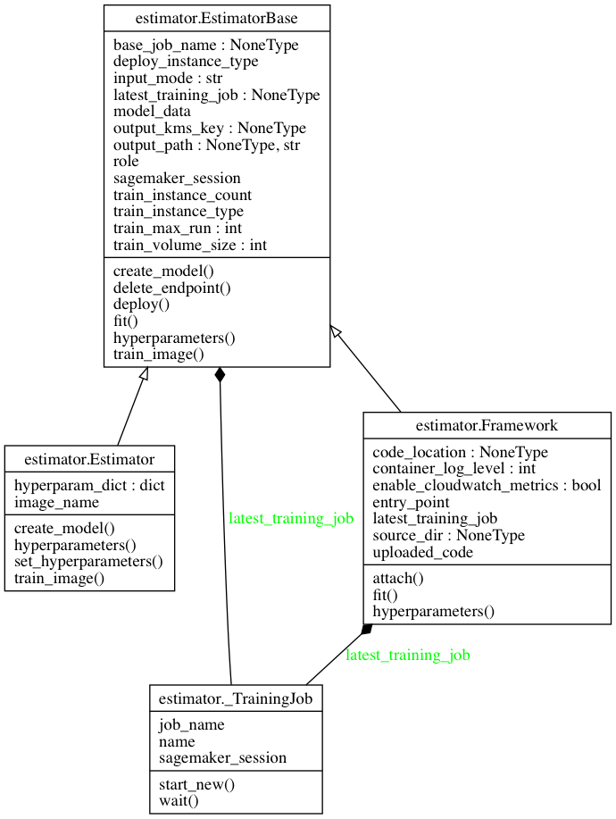
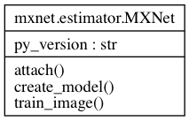
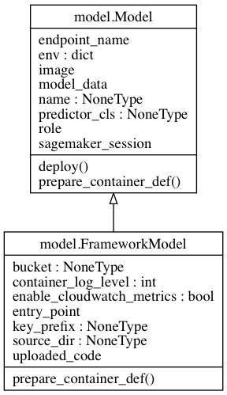
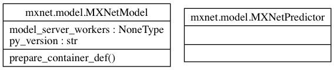
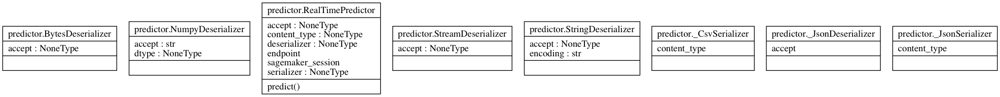

# sagemaker-demos
This repository is mainteaind by three authors:

- Muhyun Kim
- Yuval Fernbach
- Cyrus Vahid

The repository's aim is to implement most common use-cases of deep learning as SageMaker custom algorithms.

The code in this repository is not uptimized for performance and scale and is rather aiming to provide demos and tutorials.

#Introduction to AmazonSageMaker Python SDK
SageMaker Python SDK is an open source library for training and deploying machine learning models on Amazon SageMaker.

## Classes
- **Estimator:** Encapsulate training on SageMaker. Can be fit() to run training, then the resulting model deploy() ed to a SageMaker Endpoint.  
	- EstimatorBase: Abstract class from which all estimators are derived
	- Framework: Superclass fro frameworks such as MXNet and TensorFlow.

- **MXNet Estimator:** With MXNet Estimators, you can train and host MXNet models on Amazon SageMaker.  
	
		- ``attach``: Create a SageMaker ``MXNetModel`` object that can be deployed to an ``Endpoint``.
		- ``create_model``: Create an ``Estimator`` bound to an existing training job. After attaching, if
        the training job is in a Complete status, it can be ``deploy``ed to create
        a SageMaker ``Endpoint`` and return a ``Predictor``.
		- ``train_image``: ``EstimatorBase.fit`` method, which does the model training, calls this method to find the image to use for model training. The methods returns a docker image
- **Model:** Encapsulate built ML models. Can be deploy() ed to a SageMaker Endpoint.   

	- ``deploy``: Deploy this ``Model`` to an ``Endpoint`` and optionally return a ``Predictor``
	- ``prepare_container_def``: Return a dict created by ``sagemaker.container_def()`` for deploying this model to a specified instance type
- **MXNet Model**:  
	
- **Predictor**: Provide real-time inference and transformation using Python data-types against a SageMaker Endpoint     
